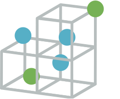

# Open Framework for Particle and Mesh Codes (OpenFPM)

OpenFPM is a scalable and open C++ framework for particles and mesh simulations.

You can build scalable molecular dynamics, Smooth Particle Hydrodybamics, Granular flow, Finite difference, Hybrid Particle-Mesh codes on CPUs and GPUs.

We provide examples for each case in the documentation.

If you use OpenFPM please cite these papers
https://www.sciencedirect.com/science/article/pii/S0010465519300852?via%3Dihub
https://link.springer.com/article/10.1140/epje/s10189-021-00121-x#citeas

## Installation
We support MacOS, Linux and Windows subsystem for Linux.

To install, run the install script with ./install and follow the instructions.

# Example and documentation

Examples and documentation is available at : http://ppmcore.mpi-cbg.de/doxygen/openfpm/index.html

3D Active Fluid Simulation with OpenFPM:

